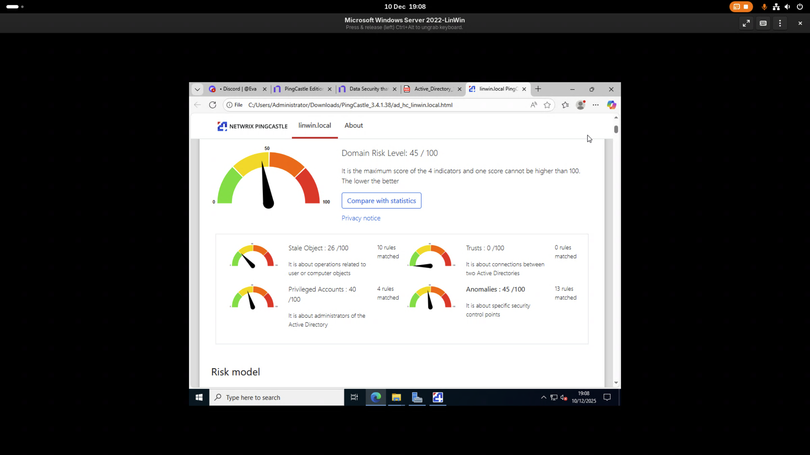

# LinWin

## 1. Introduction

* Interfacage entre un AD Microsoft Windows Server 2022 et des machines Linux Debian 13.
* Sécurisation de l'Active Directory selon le modèle Tiered (Tier 0 / Tier 1 / Tier 2).
* Collecte centralisée des logs Windows et Linux via un serveur Rsyslog sur Debian 13.

## 2. Conception de l'Infrastructure

### 2.1. Modèle de sécurité retenu

* Application des recommandations Microsoft & ANSSI\
  * [Recommendation ANSSI](https://messervices.cyber.gouv.fr/guides/recommandations-pour-ladministration-securisee-des-si-reposant-sur-ad)
* Organisation en **Tier 0 / Tier 1 / Tier 2**\
* Segmentation des rôles et des comptes\
* Stratégies de durcissement
  * Roulement de mot de passe tous les 60 jours\
  * Longueur minimale des mots de passe : 14 caractères\
  * Complexité des mots de passe\
  * Verrouillage des comptes après 5 échecs de connexion\
  

### 2.2. Schéma Active Directory

* Nom du domaine, linwin.local\
* Arborescence OU (conçue selon le modèle Tier)\
  * OU Tier 0\ DC
  * OU Tier 1\ Serveurs
  * OU Tier 2\ Utilisateurs
  * Groupes et stratégies d'administration (Pas implementées)\
    * Pas mise en place de groupes imbriqués\
    * Objets utilisateurs et machines à créer (via scripts PowerShell)\
      * Comptes administrateurs par Tier\
      * Comptes utilisateurs standards\
      * Comptes de service
      * Machines (AD-joined)
        * Scripts Powershell
        * 
      ```powershell
      
      Import-Module ActiveDirectory
  
      $domainDN = (Get-ADDomain).DistinguishedName
  
      # Create top-level OUs
      $OUs = @{
      "OU=Tier0,$domainDN" = "Tier0 - DCs and privileged admins"
      "OU=Tier1,$domainDN" = "Tier1 - Servers"
      "OU=Tier2,$domainDN" = "Tier2 - Workstations / users"
      "OU=ServiceAccounts,OU=Tier0,$domainDN" = "Service accounts (Tier0)"
      "OU=PrivAdminWorkstations,OU=Tier0,$domainDN" = "Privileged Admin Workstations (PAW)"
      "OU=LinuxHosts,OU=Tier1,$domainDN" = "Linux servers including Apache and LogServer"
      }
  
      foreach ($ouDN in $OUs.Keys) {
      if (-not (Get-ADOrganizationalUnit -Filter "DistinguishedName -eq '$ouDN'" -ErrorAction SilentlyContinue)) {
      $name = ($ouDN -split ',')[0] -replace '^OU='
      New-ADOrganizationalUnit -Name $name -Path ($ouDN -replace "^OU=[^,]+,","")
      Write-Host "Created OU: $ouDN"
      }
      }
  
      # Create Groups
      $groups = @{
      "Tier0-Admins"="OU=Tier0,$domainDN"
      "Tier1-Admins"="OU=Tier1,$domainDN"
      "Tier2-Admins"="OU=Tier2,$domainDN"
      }
  
      foreach ($g in $groups.Keys) {
      if (-not (Get-ADGroup -Filter {Name -eq $g} -ErrorAction SilentlyContinue)) {
      New-ADGroup -Name $g -GroupScope Global -GroupCategory Security -Path $groups[$g]
      Write-Host "Created group $g"
      }
      }
  
      # Create example users (change passwords!)
      $users = @(
      @{Name="dc-admin"; Given="DC"; Surname="Admin"; Sam="dcadmin"; OU="OU=Tier0,$domainDN"; Pass="ChangeMe!P0#"},
      @{Name="srv-admin"; Given="Srv"; Surname="Admin"; Sam="srvadmin"; OU="OU=Tier1,$domainDN"; Pass="ChangeMe!P1#"},
      @{Name="user1"; Given="User"; Surname="One"; Sam="user1"; OU="OU=Tier2,$domainDN"; Pass="ChangeMe!P2#"}
      )
  
      foreach ($u in $users) {
      $exist = Get-ADUser -Filter {SamAccountName -eq $u.Sam} -ErrorAction SilentlyContinue
      if (-not $exist) {
      $securePass = ConvertTo-SecureString $u.Pass -AsPlainText -Force
      New-ADUser -Name $u.Name `
            -GivenName $u.Given -Surname $u.Surname `
      -SamAccountName $u.Sam `
            -Path $u.OU `
      -AccountPassword $securePass `
            -Enabled $true `
      -ChangePasswordAtLogon $true
      Write-Host "Created user $($u.Sam)"
      }
      }
  
      # Add users to groups
      Add-ADGroupMember -Identity "Tier0-Admins" -Members "dcadmin"
      Add-ADGroupMember -Identity "Tier1-Admins" -Members "srvadmin"
      Add-ADGroupMember -Identity "Tier2-Admins" -Members "user1"
  
      Write-Host "AD Tiering setup complete."
    ```


### 2.3. Dimensionnement et composants

* Nombre de serveurs : 1
  * Idéalement 2 DC pour redondance (DC1 et DC2)\
* Description du réseau et adressage
  * /24 réseau interne dédié\
  * Adresses IP statiques pour les serveurs\
  * DNS interne pointant vers le DC\

## 3. Déploiement de l'Infrastructure Microsoft Windows

### 3.1. Installation et configuration de l'Active Directory

* Promotion du premier DC\
* Création du domaine\
* Configuration des zones DNS (Pas mis en place)\
* Mise en œuvre de la redondance AD & DNS (pas réalisée)\
  * Redondance DNS via Bind9 sur Linux
  * Configuration TSIG pour sécuriser la synchronisation DNS


### 3.2. Sécurisation Active Directory (pas réalisé)

-   GPO appliquées par Tier\
-   Durcissement des machines (ANSSI / Microsoft)\
-   Gestion des comptes sensibles\
-   Mise en œuvre de LAPS

### 3.3. Automatisation (pas réalisé)

-   Description des scripts PowerShell utilisés\
-   Création automatique des OU, groupes, utilisateurs\
-   Application des GPO\
-   Analyse de la pertinence de l'automatisation

### 3.4. Post-configuration et validation (pas réalisé)

-   Tests de jonction au domaine\
-   Vérification de la réplication AD / DNS\
-   Vérification des GPO par Tier

## 4. Services Interconnectés (pas réalisé)

### 4.2. Redondance DNS avec Bind9 et TSIG (pas réalisé)

-   Installation et configuration du serveur Linux\
-   Mise en place du DNS secondaire\
-   Génération & échange sécurisés via **TSIG**\
-   Tests de synchronisation

## 5. Collecte de Logs Windows & Linux (pas réalisé coté Windows)
### Coté Linux
* rsyslog configuré pour recevoir les logs du Serveur Apache/Vault/Bind9 via TCP sécurisé (TLS)\
* Axe d'amélioration : 
  * Redirection sécurisée via TLS\
  * Appliquer un principe de “moindre prinvilège“ en ne collectant que les logs nécessaires

### 5.1. Architecture de collecte

-   Schéma du flux des logs\
-   Outils utilisés (Syslog, WEF, Rsyslog, ...)

### 5.2. Configuration Windows

-   Activation du forwarding (Pas mis en place)\

### 5.3. Configuration Linux

-   Paramétrage syslog / rsyslog\ (utlisation de cette [doc](https://betterstack.com/community/guides/logging/how-to-configure-centralised-rsyslog-server/))
-   Paramétrage Serveur Apache, hardening config
-   Paramétrage Serveur Vault, hardening config
-   Paramétrage Serveur Bind9, hardening config


## 6. Analyse des Vulnérabilités (Bonus)

### 6.1. Outil utilisé
-   Pingcastle pour l'analyse de l'Active Directory\

### 6.2. Résultats obtenus
-  Résultats de l'analyse


## 7. Difficultés rencontrées et solutions apportées
### Partie Windows :
Malgré de nombreuses recherches, plus d'une dizaine d'heures passées à faire et refaire les différentes étapes, je n'ai pas réussi à mettre en place une infrastructure AD fonctionnelle.
Des erreurs constantes toute au long du processus, qui n'avait souvent pas de sens, ou même aucune solutions (Forum, doc officiels et sans parler de chatGPT qui n'as était .

### Partie Linux :
Trés peu de difficultés rencontrées, la documentation étant extensive sur ce sujet j'ai pu expérimenté sur beacoup plus de chose.
Seul difficulté, et pas des moindres, la connexion à l'AD via realmd, qui malgré plus de 6 tenvives que des résulats que je ne compprenais pas et que je ne comprends toujours pas à l'heure actuelle .
## 8. Conclusion
### Partie Windows :
Incompréhension de toute cette partie motivation présente mais
un constant retour en arrière pour au final ne pas réussir à tout mettre en place.


Extrêmement frustrant.

### Partie Linux :
L'excate opposée de la partie Windows, une expérience très enrichissante sur une multitude de sujet,
et qui m'algré les diffucultés etait plus “satisfesante“ qu'autre chose. (Je pense notament en disant ca au rsyslog qui est d'une simplicé à metr)
