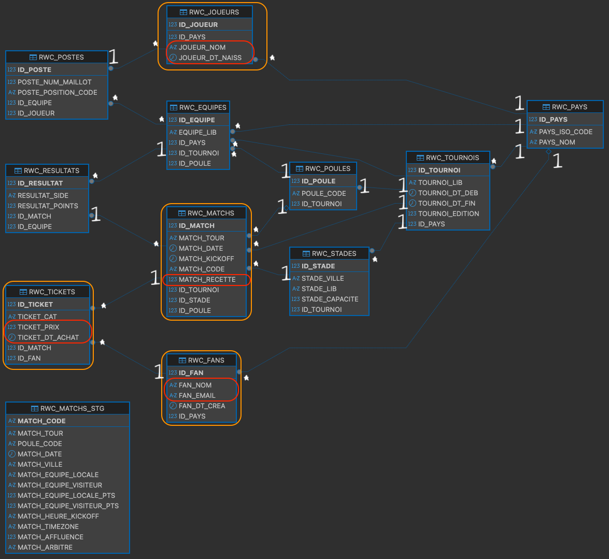

# Question 1 — Création BDD

---

# Question 2 — MLD


---

# Question 3 — Données sensibles
| Table | Colonne(s) sensible(s) | Type de sensibilité |
|---|---|---|
| RWC_FANS | FAN_EMAIL, FAN_NOM | Données personnelles |
| RWC_FANS | FAN_DT_CRE | Donnée personnelle |
| RWC_JOUEURS | JOUEUR_DT_NAISS | Donnée personnelle sensible |
| RWC_TICKETS | TICKET_PRIX, TICKET_DT_ACHAT | Donnée financière |
| RWC_MATCHS | MATCH_RECETTE | Donnée financière confidentielle |

---

# Question 4.a — Version Oracle

```
Oracle AI Database 26ai Free Release 23.26.1.0.0
Develop, Learn, and Run for Free
Version 23.26.1.0.0
```

---

# Question 4.b — Taille des tables

| Table | Taille (ko) |
|---|---|
| RWC_TICKETS | 2048 |
| RWC_FANS | 128 |
| RWC_MATCHS | 64 |
| RWC_MATCHS_STG | 64 |
| RWC_TOURNOIS | 64 |
| RWC_POSTES | 64 |
| RWC_POULES | 64 |
| RWC_RESULTATS | 64 |
| RWC_STADES | 64 |
| RWC_JOUEURS | 64 |
| RWC_EQUIPES | 64 |
| RWC_PAYS | 64 |


# Question 4.c — Privilège User

```
ALL PRIVILEGES
```
