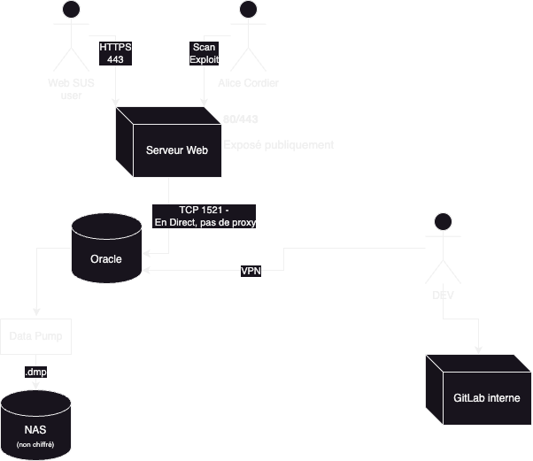

# TP04 — Analyser une architecture et identifier les failles
**Billetterie sportive — Analyse de sécurité complète**

---

## 1. DFD (Data Flow Diagram) — Architecture complète



---

## 2. Trust Boundaries et points de contrôle manquants

### Trust Boundaries identifiées

| # | Boundary | Entre quoi et quoi | Statut |
|---|----------|-------------------|--------|
| TB1 | Périmètre Internet | Internet ↔ Serveur Apache | Partiellement présente (HTTPS) |
| TB2 | Réseau interne | Serveur Apache ↔ Base Oracle | **ABSENTE** — connexion directe TCP 1521 |
| TB3 | Accès développeurs | Postes devs ↔ Base de production | Partielle (VPN uniquement) |
| TB4 | Stockage des sauvegardes | Production ↔ NAS | **ABSENTE** — pas de chiffrement |
| TB5 | Gestion des secrets | Codebase ↔ Credentials | **ABSENTE** — .env dans GitLab |

### Points de contrôle manquants

- **Pas de WAF** (Web Application Firewall) devant Apache
- **Pas de pare-feu applicatif** entre Apache et Oracle (port 1521 directement accessible)
- **Pas de comptes séparés** : un seul `app_admin` pour l'application ET les devs
- **Pas de rotation des mots de passe**
- **Pas de chiffrement au repos** sur le NAS (exports Data Pump en clair)
- **Pas de vault de secrets** (HashiCorp Vault, AWS Secrets Manager, etc.)
- **Pas d'audit logging** sur les accès base de données
- **Pas de segmentation réseau** entre les environnements (devs accèdent à la prod)
- **Pas de MFA** sur l'accès VPN ni sur GitLab

---

## 3. Analyse STRIDE par composant

### 3.1 — Serveur Web Apache

| Menace STRIDE | Description | Exemple concret |
|---------------|-------------|-----------------|
| **S** — Spoofing | Usurpation de session utilisateur | Vol de cookie de session, fixation de session |
| **T** — Tampering | Modification des requêtes HTTP | Manipulation des paramètres de prix ou de quantité |
| **R** — Repudiation | Absence de logs applicatifs fiables | Impossible de prouver qu'une commande a été passée |
| **I** — Info disclosure | Fuites via erreurs HTTP / headers | Stack trace Oracle visible, version Apache exposée |
| **D** — Denial of Service | Saturation du serveur web | DDoS HTTP, Slowloris |
| **E** — Elevation of privilege | Exploitation d'une vuln Apache | RCE via module vulnérable → accès système |

### 3.2 — Base de données Oracle

| Menace STRIDE | Description | Exemple concret |
|---------------|-------------|-----------------|
| **S** — Spoofing | Connexion avec des identifiants volés | Utilisation du mot de passe récupéré dans le .env |
| **T** — Tampering | Modification des données | Update direct sur la table des commandes |
| **R** — Repudiation | Pas d'audit trail distinct par utilisateur | `app_admin` utilisé par tous → impossible d'imputer |
| **I** — Info disclosure | Lecture de données sensibles | SELECT sur noms, emails, CB hashées |
| **D** — Denial of Service | Saturation des connexions | Flood sur port 1521, drop de tablespaces |
| **E** — Elevation of privilege | ALL PRIVILEGES déjà accordés | Aucune escalade nécessaire : accès total direct |

### 3.3 — Compte `app_admin`

| Menace STRIDE | Description |
|---------------|-------------|
| **S** — Spoofing | N'importe qui connaissant le MDP peut se faire passer pour l'application |
| **T** — Tampering | Modifications non tracées car compte partagé |
| **R** — Repudiation | Impossible d'attribuer une action à un utilisateur ou un dev |
| **I** — Info disclosure | Accès à TOUTES les tables, y compris les plus sensibles |
| **E** — Elevation of privilege | ALL PRIVILEGES = niveau maximum d'accès dès la première connexion |

### 3.4 — NAS (export Data Pump)

| Menace STRIDE | Description |
|---------------|-------------|
| **S** — Spoofing | Accès NAS sans authentification forte |
| **T** — Tampering | Modification ou suppression des backups |
| **I** — Info disclosure | Lecture du fichier .dmp → accès à toutes les données en clair |
| **D** — Denial of Service | Suppression des backups → perte de capacité de restauration |

### 3.5 — GitLab (fichier .env)

| Menace STRIDE | Description |
|---------------|-------------|
| **S** — Spoofing | Récupération du MDP → connexion directe à la prod |
| **I** — Info disclosure | Tout développeur (ou attaquant ayant accès au repo) obtient les credentials |
| **T** — Tampering | Modification du .env pour rediriger vers une base malveillante |
| **E** — Elevation of privilege | Credentials en clair = élévation immédiate à `app_admin` |

### 3.6 — Postes développeurs (accès VPN)

| Menace STRIDE | Description |
|---------------|-------------|
| **S** — Spoofing | Poste compromis → connexion légitime à la prod |
| **T** — Tampering | Dev malveillant ou compromis modifie des données en production |
| **I** — Info disclosure | Exfiltration de données depuis le poste dev |
| **E** — Elevation of privilege | VPN + `app_admin` = ALL PRIVILEGES sur la prod |

---

## 4. Chemins d'attaque (Attack Paths)

### 🔴 Attack Path 1 — Exfiltration via le dépôt GitLab

```
[Attaquant]
    │
    ├─ 1. Compromission d'un compte développeur GitLab
    │      (phishing, credential stuffing, absence MFA)
    │
    ├─ 2. Accès au dépôt → lecture du fichier .env
    │      → Récupération de app_admin / mot de passe Oracle
    │
    ├─ 3. Connexion directe à Oracle port 1521 via VPN
    │      (si VPN accessible, ou depuis un poste dev compromis)
    │
    └─ 4. SELECT * sur toutes les tables
           → Exfiltration de noms, emails, CB hashées, historique achats
           IMPACT : Violation RGPD massive
```

### 🔴 Attack Path 2 — Compromission du serveur web → mouvement latéral

```
[Attaquant externe]
    │
    ├─ 1. Exploitation d'une vulnérabilité Apache (RCE, LFI, injection)
    │      ou injection SQL via l'application
    │
    ├─ 2. Lecture du fichier .env sur le serveur web
    │      → Identifiants app_admin en clair
    │
    ├─ 3. Connexion directe à Oracle (port 1521 accessible depuis le serveur web)
    │      → ALL PRIVILEGES = accès total sans restriction
    │
    └─ 4. Dump complet de la base + persistance (création de backdoor SQL)
           IMPACT : Compromission totale, persistance longue durée
```

### 🟠 Attack Path 3 — Accès physique ou réseau au NAS

```
[Attaquant interne ou adjacent réseau]
    │
    ├─ 1. Accès au NAS (réseau interne, mauvais contrôle d'accès)
    │      → Absence de chiffrement sur les exports Data Pump
    │
    ├─ 2. Copie du fichier .dmp (export complet de la production)
    │
    └─ 3. Import local dans une base Oracle isolée
           → Accès à l'intégralité des données sans passer par le système de contrôle
           IMPACT : Exfiltration discrète, difficile à détecter
```

### 🟠 Attack Path 4 — Insider threat via développeur

```
[Développeur malveillant ou négligent]
    │
    ├─ 1. Connexion légitime via VPN avec le compte app_admin
    │      (même identifiants que l'application web)
    │
    ├─ 2. Actions en production sans traçabilité individuelle
    │      (compte partagé → impossible d'imputer)
    │
    └─ 3. Modification de données, exfiltration, ou destruction
           IMPACT : Fraude, non-répudiation impossible, risque légal
```

---

## 5. Classification des vulnérabilités par criticité

### 🔴 CRITIQUE

| ID | Vulnérabilité | Justification |
|----|--------------|---------------|
| C1 | **Credentials en clair dans GitLab (.env)** | Exposition immédiate de l'accès total à la prod pour tout développeur ou attaquant |
| C2 | **Compte `app_admin` partagé avec ALL PRIVILEGES** | Aucune séparation des privilèges, non-répudiation impossible, surface d'attaque maximale |
| C3 | **Port Oracle 1521 accessible directement depuis le serveur web** | Permet un mouvement latéral immédiat en cas de compromission Apache |

### 🟠 HAUTE

| ID | Vulnérabilité | Justification |
|----|--------------|---------------|
| H1 | **Export Data Pump non chiffré sur NAS** | Copie complète de la production accessible sans contrôle d'accès fort |
| H2 | **Développeurs connectés directement à la base de production** | Violation de la séparation prod/dev, risque d'erreur ou de malveillance |
| H3 | **Absence de WAF devant Apache** | Exposition directe aux attaques web (SQLi, XSS, RCE) |
| H4 | **Absence de MFA sur VPN et GitLab** | Un seul facteur compromis suffit à accéder à la production |

### 🟡 MOYENNE

| ID | Vulnérabilité | Justification |
|----|--------------|---------------|
| M1 | **Pas d'audit logging par utilisateur sur la base** | Impossibilité de forensics ou de détection d'anomalies |
| M2 | **Pas de segmentation réseau (DMZ)** | Apache et Oracle sur le même réseau logique |
| M3 | **Pas de rotation des mots de passe** | Un credential compromis reste valide indéfiniment |
| M4 | **Données de CB stockées même sous forme hashée** | Dépend de l'algorithme — si MD5/SHA1, risque de rainbow tables |

### 🟢 FAIBLE

| ID | Vulnérabilité | Justification |
|----|--------------|---------------|
| F1 | **Headers HTTP Apache potentiellement verbeux** | Révèle la version → facilite le ciblage |
| F2 | **Absence de politique de rétention des backups** | Risque de conservation excessive de données sensibles |

---

## 6. Plan de remédiation priorisé

### Phase 1 — Immédiat (0–7 jours) 🔴

**Objectif : Éliminer les risques critiques sans attendre**

1. **Révoquer les credentials du .env et les changer immédiatement**
   - Supprimer le fichier `.env` du dépôt GitLab (y compris l'historique git : `git filter-branch` ou BFG)
   - Changer le mot de passe `app_admin` en urgence
   - Vérifier les logs Oracle pour détecter des accès non légitimes

2. **Créer des comptes séparés avec le principe du moindre privilège**
   - `app_web` : SELECT, INSERT, UPDATE uniquement sur les tables nécessaires
   - `app_dev_readonly` : SELECT uniquement, sur environnement hors prod
   - Supprimer ALL PRIVILEGES de `app_admin` ou désactiver le compte

3. **Mettre en place un gestionnaire de secrets**
   - Intégrer HashiCorp Vault, AWS Secrets Manager ou équivalent
   - Les credentials ne doivent plus jamais figurer dans le code source

### Phase 2 — Court terme (1–4 semaines) 🟠

**Objectif : Réduire la surface d'attaque réseau**

4. **Bloquer l'accès direct au port 1521 depuis Internet et la DMZ**
   - Configurer le pare-feu pour que seul le serveur applicatif puisse accéder à Oracle
   - Idéalement : passer par une couche middleware (API Gateway, connection pooler)

5. **Chiffrer les exports Data Pump**
   - Utiliser le chiffrement natif d'Oracle Data Pump (`ENCRYPTION=ALL`)
   - Contrôler l'accès au NAS par ACL strictes et authentification forte

6. **Séparer l'accès développeurs de la production**
   - Créer un environnement de dev/staging avec des données anonymisées
   - Interdire tout accès direct des postes dev à la base de production
   - Si accès ponctuel nécessaire : bastion host avec traçabilité

7. **Activer le MFA sur VPN et GitLab**

### Phase 3 — Moyen terme (1–3 mois) 🟡

**Objectif : Renforcer la détection et la résilience**

8. **Déployer un WAF devant Apache**
   - ModSecurity + règles OWASP CRS, ou solution cloud (Cloudflare, AWS WAF)

9. **Activer l'audit logging Oracle (Oracle Unified Auditing)**
   - Logger toutes les connexions, les SELECT sur données sensibles, les DDL/DML critiques
   - Centraliser les logs dans un SIEM (Splunk, Elastic SIEM, etc.)

10. **Segmentation réseau — mise en place d'une vraie DMZ**
    - Apache dans la DMZ, Oracle dans le réseau interne isolé
    - Firewall entre les deux zones avec règles strictes

11. **Politique de rotation des mots de passe et révision des accès**
    - Rotation automatique via le vault de secrets
    - Revue trimestrielle des droits (Access Review)

12. **Vérifier l'algorithme de hashage des CB**
    - Passer à bcrypt, Argon2 ou PBKDF2 si MD5/SHA1 utilisé
    - Conformité PCI-DSS à évaluer

### Phase 4 — Long terme (3–6 mois) 🟢

13. **Chiffrement au repos de la base Oracle** (Oracle TDE — Transparent Data Encryption)
14. **Tests de pénétration réguliers** (pentest annuel minimum)
15. **Formation des développeurs** à la sécurité applicative (OWASP Top 10)
16. **Mise en place d'un processus de gestion des vulnérabilités** (CVE monitoring, patch management)

---

## Synthèse — Tableau de bord

| Priorité | Action | Effort | Impact |
|----------|--------|--------|--------|
| 🔴 P1 | Supprimer credentials du GitLab | Faible | Critique |
| 🔴 P2 | Séparer comptes DB (moindre privilège) | Moyen | Critique |
| 🔴 P3 | Gestionnaire de secrets | Moyen | Critique |
| 🟠 P4 | Bloquer port 1521 depuis DMZ | Faible | Haute |
| 🟠 P5 | Chiffrer exports Data Pump | Faible | Haute |
| 🟠 P6 | Séparer accès devs / prod | Moyen | Haute |
| 🟠 P7 | MFA sur VPN + GitLab | Faible | Haute |
| 🟡 P8 | WAF devant Apache | Moyen | Moyenne |
| 🟡 P9 | Audit logging Oracle + SIEM | Élevé | Moyenne |
| 🟡 P10 | DMZ et segmentation réseau | Élevé | Moyenne |

---

## Rappel TP


---

## Crédit

  - [@Bili-and-sheep](https://www.github.com/Bili-and-sheep)
  - [@matissime](https://www.github.com/matissime)
